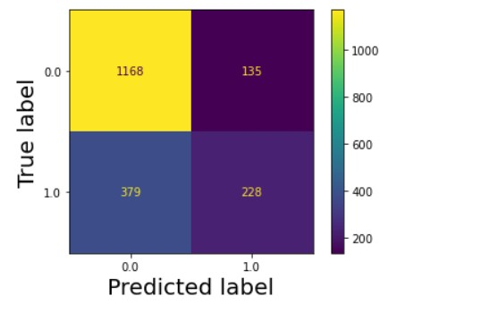
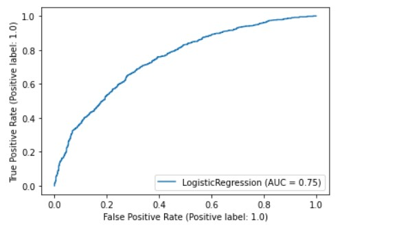
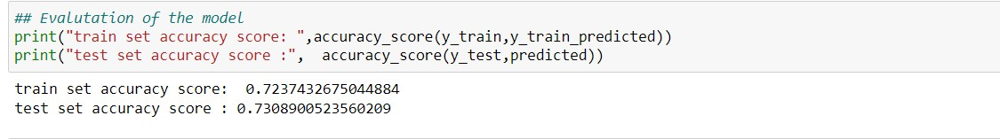

# ExtraMarital_Affair-Logisitc-Regression
Project Description 📄

❄️ Built a logistic regression model using statsmodel.api data fair to predict Affair will happen or not based on other dependent variable

# Data
We are loding the data using the statsmodel.api 
Data Name: Fair

## Data Description :

    Number of observations: 6366
    Number of variables: 9
    Variable name definitions:

        rate_marriage   : How rate marriage, 1 = very poor, 2 = poor, 3 = fair,
                        4 = good, 5 = very good
        age             : Age
        yrs_married     : No. years married. Interval approximations. See
                        original paper for detailed explanation.
        children        : No. children
        religious       : How relgious, 1 = not, 2 = mildly, 3 = fairly,
                        4 = strongly
        educ            : Level of education, 9 = grade school, 12 = high
                        school, 14 = some college, 16 = college graduate,
                        17 = some graduate school, 20 = advanced degree
        occupation      : 1 = student, 2 = farming, agriculture; semi-skilled,
                        or unskilled worker; 3 = white-colloar; 4 = teacher
                        counselor social worker, nurse; artist, writers;
                        technician, skilled worker, 5 = managerial,
                        administrative, business, 6 = professional with
                        advanced degree
        occupation_husb : Husband's occupation. Same as occupation.
        affairs         : measure of time spent in extramarital affairs
        
## Overview :
We have trained the model using simple logistic regression, as the data was suprisingly sorted and scaled, which needed less Pre-Processing

## Confusion Matrix and Roc_Auc curve :
<table>
  <tr>
    <td>Confusion Matrix</td>
     <td>ROC-AUCcurve</td>
  </tr>
  <tr>
    <td>
    <td>
  </tr>
 </table>
 <table>
  <tr>
    <td>Model accuracy</td>
  </tr>
  <tr>
    <td></td>
  </tr>
 </table>
        
